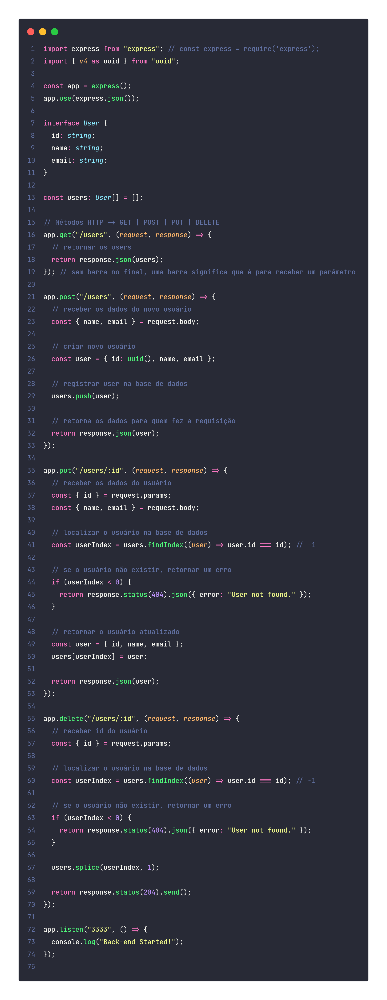

<h1 align="center">CRUDAPI</h1>

  

## ✨ Tecnologias

Esse projeto foi desenvolvido com as seguintes tecnologias:

- [Node.js](https://nodejs.org/en/)
- [Typescript](https://www.typescriptlang.org/)
- [Express](https://expressjs.com/pt-br/)

## 💻 Projeto

Uma API simples como forma de aprender os principais conceitos de uma API REST aplicados ao nodeJS, aguardem o front dessa aplicação.

## 🚀 Como executar

- Clone o repositório
- Rode `yarn` para baixar as dependências
- Rode o `yarn dev` para iniciar a aplicação.

Por fim, a aplicação estará disponível em `http://localhost:3333`

---
Feito com 💜 &nbsp;no bootcamp da Cataline 👋🏻 &nbsp;